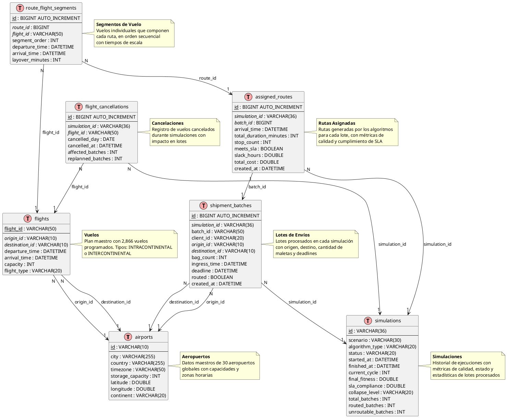
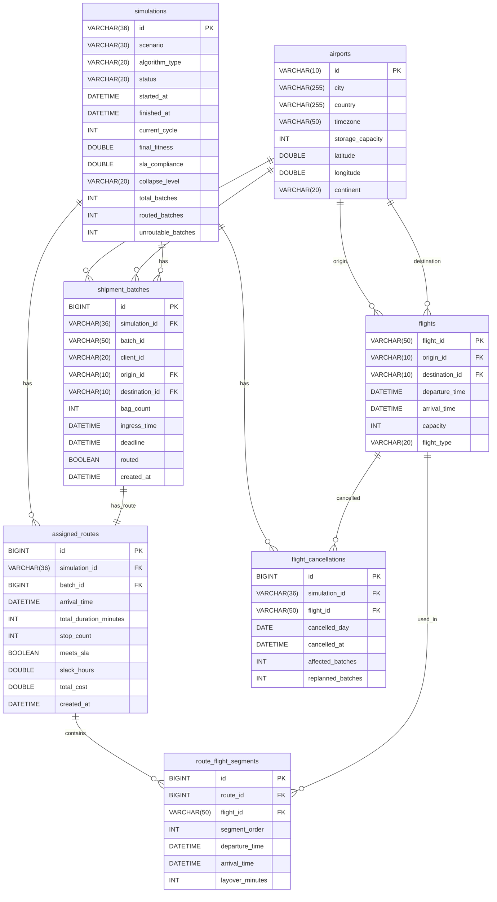

# Diagrama de Base de Datos - Sistema de Planificación Logística

## 📊 Modelo Entidad-Relación

El sistema utiliza MySQL para persistir datos maestros y el historial de simulaciones.

---

## Diagrama UML (PlantUML)



---

## Diagrama Mermaid (para GitHub/GitLab)



---

## Descripción de Tablas

### 1. `airports` - Aeropuertos

Almacena información de los 30 aeropuertos globales.

| Campo | Tipo | Descripción |
|-------|------|-------------|
| **id** | VARCHAR(10) | Código ICAO (PK). Ej: SKBO, SPIM |
| city | VARCHAR(255) | Ciudad del aeropuerto |
| country | VARCHAR(255) | País |
| timezone | VARCHAR(50) | Zona horaria (ZoneId). Ej: UTC-5 |
| storage_capacity | INT | Capacidad de almacenamiento (maletas) |
| latitude | DOUBLE | Latitud en grados decimales |
| longitude | DOUBLE | Longitud en grados decimales |
| continent | VARCHAR(20) | Continente: AMERICA, EUROPE, ASIA |

**Ejemplo**:
```sql
INSERT INTO airports VALUES 
('SKBO', 'Bogota', 'Colombia', 'UTC-5', 430, 4.7014, -74.1469, 'AMERICA');
```

### 2. `flights` - Vuelos

Plan maestro con 2,866 vuelos programados.

| Campo | Tipo | Descripción |
|-------|------|-------------|
| **flight_id** | VARCHAR(50) | ID único del vuelo (PK). Ej: SKBO-SEQM-03:34 |
| origin_id | VARCHAR(10) | Aeropuerto origen (FK → airports) |
| destination_id | VARCHAR(10) | Aeropuerto destino (FK → airports) |
| departure_time | DATETIME | Hora de salida (con zona horaria) |
| arrival_time | DATETIME | Hora de llegada (con zona horaria) |
| capacity | INT | Capacidad en maletas |
| flight_type | VARCHAR(20) | INTRACONTINENTAL o INTERCONTINENTAL |

**Ejemplo**:
```sql
INSERT INTO flights VALUES 
('SKBO-SEQM-03:34', 'SKBO', 'SEQM', 
 '2026-01-01 03:34:00-05:00', '2026-01-01 04:21:00-05:00', 
 300, 'INTRACONTINENTAL');
```

**Relaciones**:
- `origin_id` → `airports.id`
- `destination_id` → `airports.id`

### 3. `simulations` - Simulaciones

Historial de ejecuciones del sistema.

| Campo | Tipo | Descripción |
|-------|------|-------------|
| **id** | VARCHAR(36) | UUID de la simulación (PK) |
| scenario | VARCHAR(30) | Escenario: K1, K14, K75 |
| algorithm_type | VARCHAR(20) | GATS o TABU_PURE |
| status | VARCHAR(20) | RUNNING, PAUSED, STOPPED, COMPLETED |
| started_at | DATETIME | Timestamp de inicio |
| finished_at | DATETIME | Timestamp de finalización (nullable) |
| current_cycle | INT | Ciclo actual de planificación |
| final_fitness | DOUBLE | Fitness final de la solución |
| sla_compliance | DOUBLE | % de cumplimiento de SLA |
| collapse_level | VARCHAR(20) | Nivel de colapso: NONE, LOW, MEDIUM, HIGH |
| total_batches | INT | Total de lotes procesados |
| routed_batches | INT | Lotes con ruta asignada |
| unroutable_batches | INT | Lotes sin ruta posible |

**Ejemplo**:
```sql
INSERT INTO simulations VALUES 
('550e8400-e29b-41d4-a716-446655440000', 'K1', 'GATS', 'COMPLETED',
 '2026-04-21 10:00:00', '2026-04-21 10:05:00',
 27, -154850.00, 100.00, 'NONE', 27, 27, 0);
```

### 4. `shipment_batches` - Lotes de Envíos

Lotes procesados en cada simulación.

| Campo | Tipo | Descripción |
|-------|------|-------------|
| **id** | BIGINT | ID autoincremental (PK) |
| simulation_id | VARCHAR(36) | ID de la simulación (FK → simulations) |
| batch_id | VARCHAR(50) | ID del lote. Ej: SKBO-000000001 |
| client_id | VARCHAR(20) | ID del cliente propietario |
| origin_id | VARCHAR(10) | Aeropuerto origen (FK → airports) |
| destination_id | VARCHAR(10) | Aeropuerto destino (FK → airports) |
| bag_count | INT | Número de maletas en el lote |
| ingress_time | DATETIME | Timestamp de ingreso al sistema |
| deadline | DATETIME | Deadline de entrega (SLA) |
| routed | BOOLEAN | Si se le asignó una ruta |
| created_at | DATETIME | Timestamp de creación del registro |

**Ejemplo**:
```sql
INSERT INTO shipment_batches VALUES 
(1, '550e8400-e29b-41d4-a716-446655440000', 'SKBO-000000001', '0019169',
 'SKBO', 'SPIM', 2, '2026-01-02 00:55:00', '2026-01-05 00:00:00', 
 TRUE, '2026-04-21 10:01:00');
```

**Relaciones**:
- `simulation_id` → `simulations.id`
- `origin_id` → `airports.id`
- `destination_id` → `airports.id`

### 5. `assigned_routes` - Rutas Asignadas

Rutas generadas por los algoritmos para cada lote.

| Campo | Tipo | Descripción |
|-------|------|-------------|
| **id** | BIGINT | ID autoincremental (PK) |
| simulation_id | VARCHAR(36) | ID de la simulación (FK → simulations) |
| batch_id | BIGINT | ID del lote (FK → shipment_batches) |
| arrival_time | DATETIME | Hora de llegada al destino |
| total_duration_minutes | INT | Duración total del viaje |
| stop_count | INT | Número de escalas |
| meets_sla | BOOLEAN | Si cumple el SLA |
| slack_hours | DOUBLE | Horas de holgura antes del deadline |
| total_cost | DOUBLE | Costo total de la ruta |
| created_at | DATETIME | Timestamp de creación |

**Ejemplo**:
```sql
INSERT INTO assigned_routes VALUES 
(1, '550e8400-e29b-41d4-a716-446655440000', 1,
 '2026-01-02 08:30:00', 450, 1, TRUE, 64.5, 1250.00,
 '2026-04-21 10:01:00');
```

**Relaciones**:
- `simulation_id` → `simulations.id`
- `batch_id` → `shipment_batches.id`

### 6. `route_flight_segments` - Segmentos de Vuelo

Vuelos individuales que componen cada ruta.

| Campo | Tipo | Descripción |
|-------|------|-------------|
| **id** | BIGINT | ID autoincremental (PK) |
| route_id | BIGINT | ID de la ruta (FK → assigned_routes) |
| flight_id | VARCHAR(50) | ID del vuelo (FK → flights) |
| segment_order | INT | Orden del segmento en la ruta (1, 2, 3...) |
| departure_time | DATETIME | Hora de salida del vuelo |
| arrival_time | DATETIME | Hora de llegada del vuelo |
| layover_minutes | INT | Minutos de escala antes del siguiente vuelo |

**Ejemplo**:
```sql
-- Ruta con 2 vuelos: SKBO → SCEL → SPIM
INSERT INTO route_flight_segments VALUES 
(1, 1, 'SKBO-SCEL-03:00', 1, '2026-01-02 03:00:00', '2026-01-02 06:30:00', 60),
(2, 1, 'SCEL-SPIM-07:30', 2, '2026-01-02 07:30:00', '2026-01-02 08:30:00', 0);
```

**Relaciones**:
- `route_id` → `assigned_routes.id`
- `flight_id` → `flights.flight_id`

### 7. `flight_cancellations` - Cancelaciones de Vuelos

Registro de vuelos cancelados durante simulaciones.

| Campo | Tipo | Descripción |
|-------|------|-------------|
| **id** | BIGINT | ID autoincremental (PK) |
| simulation_id | VARCHAR(36) | ID de la simulación (FK → simulations) |
| flight_id | VARCHAR(50) | ID del vuelo cancelado (FK → flights) |
| cancelled_day | DATE | Día de la cancelación |
| cancelled_at | DATETIME | Timestamp exacto de cancelación |
| affected_batches | INT | Número de lotes afectados |
| replanned_batches | INT | Número de lotes replanificados |

**Ejemplo**:
```sql
INSERT INTO flight_cancellations VALUES 
(1, '550e8400-e29b-41d4-a716-446655440000', 'SKBO-SEQM-03:34',
 '2026-01-05', '2026-01-05 03:00:00', 15, 12);
```

**Relaciones**:
- `simulation_id` → `simulations.id`
- `flight_id` → `flights.flight_id`

---

## Relaciones entre Tablas

### Diagrama de Relaciones

```
DATOS MAESTROS:
airports (1) ←──── (N) flights [origin_id]
airports (1) ←──── (N) flights [destination_id]

SIMULACIONES Y LOTES:
simulations (1) ←──── (N) shipment_batches [simulation_id]
airports (1) ←──── (N) shipment_batches [origin_id]
airports (1) ←──── (N) shipment_batches [destination_id]

RUTAS Y SEGMENTOS:
simulations (1) ←──── (N) assigned_routes [simulation_id]
shipment_batches (1) ←──── (1) assigned_routes [batch_id]
assigned_routes (1) ←──── (N) route_flight_segments [route_id]
flights (1) ←──── (N) route_flight_segments [flight_id]

CANCELACIONES:
simulations (1) ←──── (N) flight_cancellations [simulation_id]
flights (1) ←──── (N) flight_cancellations [flight_id]
```

### Cardinalidades

1. **airports → flights (origin/destination)**
   - Un aeropuerto puede ser origen/destino de muchos vuelos (1:N)
   
2. **simulations → shipment_batches**
   - Una simulación procesa muchos lotes (1:N)

3. **airports → shipment_batches (origin/destination)**
   - Un aeropuerto puede ser origen/destino de muchos lotes (1:N)

4. **shipment_batches → assigned_routes**
   - Un lote tiene una ruta asignada (1:1)
   - Un lote puede no tener ruta si es unroutable

5. **assigned_routes → route_flight_segments**
   - Una ruta contiene múltiples segmentos de vuelo (1:N)

6. **flights → route_flight_segments**
   - Un vuelo puede ser usado en múltiples rutas (1:N)

7. **simulations → flight_cancellations**
   - Una simulación puede tener muchas cancelaciones (1:N)

8. **flights → flight_cancellations**
   - Un vuelo puede ser cancelado en múltiples simulaciones (1:N)

---

## Índices Recomendados

```sql
-- Índices en flights para búsquedas frecuentes
CREATE INDEX idx_flights_origin ON flights(origin_id);
CREATE INDEX idx_flights_destination ON flights(destination_id);
CREATE INDEX idx_flights_departure ON flights(departure_time);

-- Índices en flight_cancellations
CREATE INDEX idx_cancellations_simulation ON flight_cancellations(simulation_id);
CREATE INDEX idx_cancellations_flight ON flight_cancellations(flight_id);
CREATE INDEX idx_cancellations_day ON flight_cancellations(cancelled_day);

-- Índice en simulations
CREATE INDEX idx_simulations_scenario ON simulations(scenario);
CREATE INDEX idx_simulations_status ON simulations(status);
```

---

## Script de Creación (MySQL)

```sql
-- Crear base de datos
CREATE DATABASE IF NOT EXISTS scheduler_db 
CHARACTER SET utf8mb4 COLLATE utf8mb4_unicode_ci;

USE scheduler_db;

-- ============================================
-- TABLAS MAESTRAS
-- ============================================

-- Tabla airports
CREATE TABLE airports (
    id VARCHAR(10) PRIMARY KEY,
    city VARCHAR(255) NOT NULL,
    country VARCHAR(255),
    timezone VARCHAR(50),
    storage_capacity INT,
    latitude DOUBLE,
    longitude DOUBLE,
    continent VARCHAR(20)
) ENGINE=InnoDB;

-- Tabla flights
CREATE TABLE flights (
    flight_id VARCHAR(50) PRIMARY KEY,
    origin_id VARCHAR(10) NOT NULL,
    destination_id VARCHAR(10) NOT NULL,
    departure_time DATETIME NOT NULL,
    arrival_time DATETIME NOT NULL,
    capacity INT NOT NULL,
    flight_type VARCHAR(20),
    FOREIGN KEY (origin_id) REFERENCES airports(id),
    FOREIGN KEY (destination_id) REFERENCES airports(id),
    INDEX idx_origin (origin_id),
    INDEX idx_destination (destination_id),
    INDEX idx_departure (departure_time)
) ENGINE=InnoDB;

-- ============================================
-- TABLAS DE SIMULACIÓN
-- ============================================

-- Tabla simulations
CREATE TABLE simulations (
    id VARCHAR(36) PRIMARY KEY,
    scenario VARCHAR(30),
    algorithm_type VARCHAR(20),
    status VARCHAR(20),
    started_at DATETIME,
    finished_at DATETIME,
    current_cycle INT DEFAULT 0,
    final_fitness DOUBLE DEFAULT 0.0,
    sla_compliance DOUBLE DEFAULT 0.0,
    collapse_level VARCHAR(20),
    total_batches INT DEFAULT 0,
    routed_batches INT DEFAULT 0,
    unroutable_batches INT DEFAULT 0,
    INDEX idx_scenario (scenario),
    INDEX idx_status (status),
    INDEX idx_algorithm (algorithm_type)
) ENGINE=InnoDB;

-- Tabla shipment_batches
CREATE TABLE shipment_batches (
    id BIGINT AUTO_INCREMENT PRIMARY KEY,
    simulation_id VARCHAR(36) NOT NULL,
    batch_id VARCHAR(50) NOT NULL,
    client_id VARCHAR(20),
    origin_id VARCHAR(10) NOT NULL,
    destination_id VARCHAR(10) NOT NULL,
    bag_count INT NOT NULL,
    ingress_time DATETIME NOT NULL,
    deadline DATETIME NOT NULL,
    routed BOOLEAN DEFAULT FALSE,
    created_at DATETIME DEFAULT CURRENT_TIMESTAMP,
    FOREIGN KEY (simulation_id) REFERENCES simulations(id) ON DELETE CASCADE,
    FOREIGN KEY (origin_id) REFERENCES airports(id),
    FOREIGN KEY (destination_id) REFERENCES airports(id),
    INDEX idx_simulation (simulation_id),
    INDEX idx_batch_id (batch_id),
    INDEX idx_origin (origin_id),
    INDEX idx_destination (destination_id),
    INDEX idx_routed (routed)
) ENGINE=InnoDB;

-- Tabla assigned_routes
CREATE TABLE assigned_routes (
    id BIGINT AUTO_INCREMENT PRIMARY KEY,
    simulation_id VARCHAR(36) NOT NULL,
    batch_id BIGINT NOT NULL,
    arrival_time DATETIME NOT NULL,
    total_duration_minutes INT,
    stop_count INT DEFAULT 0,
    meets_sla BOOLEAN DEFAULT TRUE,
    slack_hours DOUBLE DEFAULT 0.0,
    total_cost DOUBLE DEFAULT 0.0,
    created_at DATETIME DEFAULT CURRENT_TIMESTAMP,
    FOREIGN KEY (simulation_id) REFERENCES simulations(id) ON DELETE CASCADE,
    FOREIGN KEY (batch_id) REFERENCES shipment_batches(id) ON DELETE CASCADE,
    INDEX idx_simulation (simulation_id),
    INDEX idx_batch (batch_id),
    INDEX idx_meets_sla (meets_sla)
) ENGINE=InnoDB;

-- Tabla route_flight_segments
CREATE TABLE route_flight_segments (
    id BIGINT AUTO_INCREMENT PRIMARY KEY,
    route_id BIGINT NOT NULL,
    flight_id VARCHAR(50) NOT NULL,
    segment_order INT NOT NULL,
    departure_time DATETIME NOT NULL,
    arrival_time DATETIME NOT NULL,
    layover_minutes INT DEFAULT 0,
    FOREIGN KEY (route_id) REFERENCES assigned_routes(id) ON DELETE CASCADE,
    FOREIGN KEY (flight_id) REFERENCES flights(flight_id),
    INDEX idx_route (route_id),
    INDEX idx_flight (flight_id),
    INDEX idx_order (route_id, segment_order)
) ENGINE=InnoDB;

-- Tabla flight_cancellations
CREATE TABLE flight_cancellations (
    id BIGINT AUTO_INCREMENT PRIMARY KEY,
    simulation_id VARCHAR(36) NOT NULL,
    flight_id VARCHAR(50) NOT NULL,
    cancelled_day DATE NOT NULL,
    cancelled_at DATETIME NOT NULL,
    affected_batches INT DEFAULT 0,
    replanned_batches INT DEFAULT 0,
    FOREIGN KEY (simulation_id) REFERENCES simulations(id) ON DELETE CASCADE,
    FOREIGN KEY (flight_id) REFERENCES flights(flight_id),
    INDEX idx_simulation (simulation_id),
    INDEX idx_flight (flight_id),
    INDEX idx_day (cancelled_day)
) ENGINE=InnoDB;
```

---

## Consultas Útiles

### 1. Obtener rutas completas de una simulación

```sql
SELECT 
    sb.batch_id,
    sb.origin_id,
    sb.destination_id,
    sb.bag_count,
    ar.arrival_time,
    ar.stop_count,
    ar.meets_sla,
    ar.slack_hours,
    GROUP_CONCAT(
        CONCAT(rfs.segment_order, ': ', rfs.flight_id) 
        ORDER BY rfs.segment_order 
        SEPARATOR ' → '
    ) AS route_path
FROM shipment_batches sb
JOIN assigned_routes ar ON sb.id = ar.batch_id
JOIN route_flight_segments rfs ON ar.id = rfs.route_id
WHERE sb.simulation_id = '550e8400-e29b-41d4-a716-446655440000'
GROUP BY sb.id, sb.batch_id, sb.origin_id, sb.destination_id, 
         sb.bag_count, ar.arrival_time, ar.stop_count, ar.meets_sla, ar.slack_hours
ORDER BY sb.batch_id;
```

### 2. Estadísticas de una simulación

```sql
SELECT 
    s.id,
    s.scenario,
    s.algorithm_type,
    s.status,
    TIMESTAMPDIFF(SECOND, s.started_at, s.finished_at) AS duration_seconds,
    s.total_batches,
    s.routed_batches,
    s.unroutable_batches,
    ROUND((s.routed_batches * 100.0 / s.total_batches), 2) AS routing_success_rate,
    s.sla_compliance,
    s.final_fitness,
    s.collapse_level,
    COUNT(DISTINCT fc.id) AS total_cancellations,
    SUM(fc.affected_batches) AS total_affected_batches
FROM simulations s
LEFT JOIN flight_cancellations fc ON s.id = fc.simulation_id
WHERE s.id = '550e8400-e29b-41d4-a716-446655440000'
GROUP BY s.id;
```

### 3. Análisis de vuelos más utilizados

```sql
SELECT 
    f.flight_id,
    a_origin.city AS origin_city,
    a_dest.city AS destination_city,
    f.capacity,
    COUNT(DISTINCT rfs.route_id) AS times_used,
    SUM(sb.bag_count) AS total_bags_transported,
    ROUND((SUM(sb.bag_count) * 100.0 / f.capacity), 2) AS avg_occupancy_pct
FROM flights f
JOIN route_flight_segments rfs ON f.flight_id = rfs.flight_id
JOIN assigned_routes ar ON rfs.route_id = ar.id
JOIN shipment_batches sb ON ar.batch_id = sb.id
JOIN airports a_origin ON f.origin_id = a_origin.id
JOIN airports a_dest ON f.destination_id = a_dest.id
WHERE sb.simulation_id = '550e8400-e29b-41d4-a716-446655440000'
GROUP BY f.flight_id, a_origin.city, a_dest.city, f.capacity
ORDER BY times_used DESC
LIMIT 20;
```

### 4. Lotes no enrutables por simulación

```sql
SELECT 
    s.scenario,
    s.algorithm_type,
    sb.batch_id,
    a_origin.city AS origin,
    a_dest.city AS destination,
    sb.bag_count,
    sb.ingress_time,
    sb.deadline,
    TIMESTAMPDIFF(HOUR, sb.ingress_time, sb.deadline) AS available_hours
FROM shipment_batches sb
JOIN simulations s ON sb.simulation_id = s.id
JOIN airports a_origin ON sb.origin_id = a_origin.id
JOIN airports a_dest ON sb.destination_id = a_dest.id
WHERE sb.routed = FALSE
  AND s.id = '550e8400-e29b-41d4-a716-446655440000'
ORDER BY sb.batch_id;
```

### 5. Comparación de algoritmos

```sql
SELECT 
    s.algorithm_type,
    COUNT(DISTINCT s.id) AS num_simulations,
    AVG(TIMESTAMPDIFF(SECOND, s.started_at, s.finished_at)) AS avg_duration_sec,
    AVG(s.final_fitness) AS avg_fitness,
    AVG(s.sla_compliance) AS avg_sla_compliance,
    AVG(s.routed_batches * 100.0 / s.total_batches) AS avg_routing_success,
    SUM(s.total_batches) AS total_batches_processed,
    SUM(s.unroutable_batches) AS total_unroutable
FROM simulations s
WHERE s.status = 'COMPLETED'
  AND s.scenario = 'K1'
GROUP BY s.algorithm_type;
```

### 6. Rutas con más escalas

```sql
SELECT 
    sb.batch_id,
    a_origin.city AS origin,
    a_dest.city AS destination,
    ar.stop_count,
    ar.total_duration_minutes,
    ar.meets_sla,
    GROUP_CONCAT(
        CONCAT(a_seg_origin.city, ' → ', a_seg_dest.city)
        ORDER BY rfs.segment_order
        SEPARATOR ' | '
    ) AS route_segments
FROM assigned_routes ar
JOIN shipment_batches sb ON ar.batch_id = sb.id
JOIN airports a_origin ON sb.origin_id = a_origin.id
JOIN airports a_dest ON sb.destination_id = a_dest.id
JOIN route_flight_segments rfs ON ar.id = rfs.route_id
JOIN flights f ON rfs.flight_id = f.flight_id
JOIN airports a_seg_origin ON f.origin_id = a_seg_origin.id
JOIN airports a_seg_dest ON f.destination_id = a_seg_dest.id
WHERE sb.simulation_id = '550e8400-e29b-41d4-a716-446655440000'
GROUP BY sb.batch_id, a_origin.city, a_dest.city, 
         ar.stop_count, ar.total_duration_minutes, ar.meets_sla
ORDER BY ar.stop_count DESC
LIMIT 10;
```

### 7. Impacto de cancelaciones

```sql
SELECT 
    fc.cancelled_day,
    fc.flight_id,
    f.origin_id,
    f.destination_id,
    fc.affected_batches,
    fc.replanned_batches,
    (fc.affected_batches - fc.replanned_batches) AS unserviceable_batches,
    ROUND((fc.replanned_batches * 100.0 / fc.affected_batches), 2) AS replan_success_rate
FROM flight_cancellations fc
JOIN flights f ON fc.flight_id = f.flight_id
WHERE fc.simulation_id = '550e8400-e29b-41d4-a716-446655440000'
ORDER BY fc.cancelled_at;
```

### 8. Ocupación de aeropuertos (lotes procesados)

```sql
SELECT 
    a.id,
    a.city,
    a.continent,
    COUNT(DISTINCT CASE WHEN sb.origin_id = a.id THEN sb.id END) AS batches_originated,
    COUNT(DISTINCT CASE WHEN sb.destination_id = a.id THEN sb.id END) AS batches_received,
    SUM(CASE WHEN sb.origin_id = a.id THEN sb.bag_count ELSE 0 END) AS bags_sent,
    SUM(CASE WHEN sb.destination_id = a.id THEN sb.bag_count ELSE 0 END) AS bags_received
FROM airports a
LEFT JOIN shipment_batches sb ON (a.id = sb.origin_id OR a.id = sb.destination_id)
    AND sb.simulation_id = '550e8400-e29b-41d4-a716-446655440000'
GROUP BY a.id, a.city, a.continent
ORDER BY (bags_sent + bags_received) DESC;
```

---

## Notas de Implementación

### Tecnologías Utilizadas

- **JPA/Hibernate**: ORM para mapeo objeto-relacional
- **Spring Data JPA**: Repositorios para acceso a datos
- **MySQL 8.0+**: Base de datos relacional
- **HikariCP**: Pool de conexiones

### Configuración de Persistencia

```properties
# application.properties
spring.datasource.url=jdbc:mysql://localhost:3306/scheduler_db
spring.datasource.username=root
spring.datasource.password=password
spring.jpa.hibernate.ddl-auto=update
spring.jpa.show-sql=true
spring.jpa.properties.hibernate.dialect=org.hibernate.dialect.MySQL8Dialect
```

### Repositorios JPA

```java
// Repositorios para datos maestros
public interface AirportRepository extends JpaRepository<AirportEntity, String> {
    List<AirportEntity> findByContinent(String continent);
}

public interface FlightRepository extends JpaRepository<FlightEntity, String> {
    List<FlightEntity> findByOriginId(String originId);
    List<FlightEntity> findByOriginIdAndDestinationId(String originId, String destinationId);
    List<FlightEntity> findByFlightType(String flightType);
}

// Repositorios para simulaciones
public interface SimulationRepository extends JpaRepository<SimulationEntity, String> {
    List<SimulationEntity> findByStatus(String status);
    List<SimulationEntity> findByScenario(String scenario);
    List<SimulationEntity> findByAlgorithmType(String algorithmType);
    List<SimulationEntity> findByScenarioAndAlgorithmType(String scenario, String algorithmType);
}

// Repositorios para lotes y rutas
public interface ShipmentBatchRepository extends JpaRepository<ShipmentBatchEntity, Long> {
    List<ShipmentBatchEntity> findBySimulationId(String simulationId);
    List<ShipmentBatchEntity> findBySimulationIdAndRouted(String simulationId, boolean routed);
    long countBySimulationId(String simulationId);
    long countBySimulationIdAndRouted(String simulationId, boolean routed);
    
    @Query("SELECT sb FROM ShipmentBatchEntity sb WHERE sb.simulationId = :simId AND sb.originId = :airportId")
    List<ShipmentBatchEntity> findBySimulationAndOrigin(@Param("simId") String simId, 
                                                         @Param("airportId") String airportId);
}

public interface AssignedRouteRepository extends JpaRepository<AssignedRouteEntity, Long> {
    List<AssignedRouteEntity> findBySimulationId(String simulationId);
    Optional<AssignedRouteEntity> findByBatchId(Long batchId);
    List<AssignedRouteEntity> findBySimulationIdAndMeetsSla(String simulationId, boolean meetsSla);
    
    @Query("SELECT AVG(ar.slackHours) FROM AssignedRouteEntity ar WHERE ar.simulationId = :simId")
    Double getAverageSlackHours(@Param("simId") String simId);
    
    @Query("SELECT ar FROM AssignedRouteEntity ar WHERE ar.simulationId = :simId ORDER BY ar.stopCount DESC")
    List<AssignedRouteEntity> findRoutesWithMostStops(@Param("simId") String simId, Pageable pageable);
}

public interface RouteFlightSegmentRepository extends JpaRepository<RouteFlightSegmentEntity, Long> {
    List<RouteFlightSegmentEntity> findByRouteIdOrderBySegmentOrder(Long routeId);
    
    @Query("SELECT rfs.flightId, COUNT(rfs) as usage FROM RouteFlightSegmentEntity rfs " +
           "JOIN AssignedRouteEntity ar ON rfs.routeId = ar.id " +
           "WHERE ar.simulationId = :simId " +
           "GROUP BY rfs.flightId ORDER BY usage DESC")
    List<Object[]> findMostUsedFlights(@Param("simId") String simId, Pageable pageable);
}

// Repositorio para cancelaciones
public interface FlightCancellationRepository extends JpaRepository<FlightCancellationEntity, Long> {
    List<FlightCancellationEntity> findBySimulationId(String simulationId);
    List<FlightCancellationEntity> findBySimulationIdOrderByCancelledAt(String simulationId);
    
    @Query("SELECT SUM(fc.affectedBatches) FROM FlightCancellationEntity fc WHERE fc.simulationId = :simId")
    Integer getTotalAffectedBatches(@Param("simId") String simId);
}
```

---

**Fecha**: 2026-04-21  
**Versión**: 1.0  
**Motor**: MySQL 8.0+  
**ORM**: JPA/Hibernate
