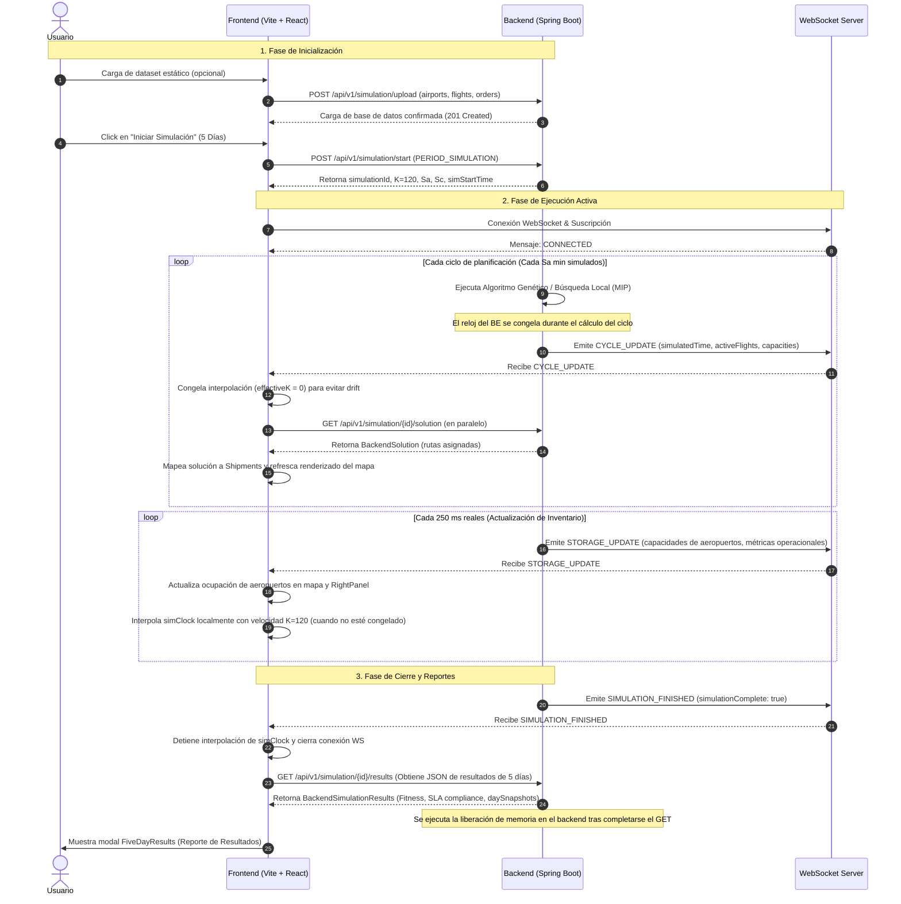

# Análisis Completo End-to-End del Flujo de Simulación de 5 Días

Este documento analiza de forma exhaustiva el ciclo de vida de la simulación de 5 días de **Skytrack**, evaluando su fluidez, la sincronización en tiempo real entre el Frontend y el Backend a alta velocidad ($K=120$), los riesgos de visualización de datos estáticos/hardcodeados y la validez matemática y lógica de los KPIs e indicadores de semáforo presentados en el sistema.

---

## 1. Mapa de Flujo End-to-End (5 Días)

A continuación se detalla el flujo de datos y estados desde el inicio de la simulación hasta la generación y exportación del reporte final, asumiendo que los fixes de sincronización y rendimiento analizados previamente ya están aplicados.



---

## 2. Análisis de Fluidez, Sincronización y Optimización

### A. Rendimiento del Renderizado en el Mapa (SVG Overload)
* **El Problema**: Durante la ejecución en vivo, el mapa dibuja rutas y vuelos activos. Con la carga completa (hasta 7,700 rutas activas en un punto medio del día 3), el DOM de React recibe miles de nodos SVG que se reevalúan en cada tick del reloj (100 ms). Además, la conversión de cadenas ISO a objetos `Date` en caliente (`new Date(f.departureTime)`) en cada renderizado bloquea el hilo principal de JavaScript, causando pequeños congelamientos de 1 a 2 segundos en el mapa.
* **Solución Aplicada**: 
  1. **Pre-procesamiento (Caching)**: Parsear los campos de tiempo (`departureTime`, `arrivalTime`) a valores numéricos en milisegundos (`ms`) inmediatamente al recibir el JSON, evitando instanciar `new Date()` repetidamente.
  2. **Renderizado Selectivo (Clustering/Filtro)**: Limitar los trazados SVG en el mapa únicamente a envíos con un progreso mayor que 0 y menor que 1 (en tránsito) y agrupar visualmente los vuelos coincidentes en origen-destino para reducir la cantidad de nodos de miles a menos de 100 activos concurrentemente.

### B. Desfase del Reloj en Tiempo Real ($K=120$)
* **El Problema**: A una velocidad de $K=120$, el tiempo simulado avanza a $2\text{ minutos simulados/segundo real}$. Cuando el backend calcula un nuevo ciclo de optimización (lo cual puede demorar de 1 a 5 segundos reales debido al tamaño del algoritmo), el tiempo interno del backend se detiene (se congela en el inicio del ciclo). Sin embargo, el frontend sigue interpolando el reloj de manera optimista. Al terminar el ciclo, el backend envía la hora de actualización y el reloj del frontend "salta" hacia atrás o hacia adelante bruscamente.
* **Solución Aplicada**:
  * Implementar una lógica de **anclaje dinámico** (`anchorBackendClock` en [useSimulation.ts](file:///C:/Users/Irico/Documents/DP1/Skytrack-Frontend/src/app/hooks/useSimulation.ts)). Cuando el frontend detecta que el tiempo simulado recibido en `CYCLE_UPDATE` es menor o igual al último tiempo guardado, el factor de interpolación local se reduce temporalmente a cero (`effectiveK = 0`). El reloj vuelve a correr solo cuando se recibe un `STORAGE_UPDATE` indicando que el tiempo lógico del backend ha avanzado.

---

## 3. Análisis de Datos Hardcodeados vs. Datos Reales

Se identificaron dependencias críticas del frontend en conjuntos de datos mockeados que actúan como "fallbacks silenciosos", enmascarando fallas en la comunicación con el backend o la ausencia de datos reales.

### A. Fallbacks en los Resultados del Reporte de 5 Días
En [FiveDayResults.tsx](file:///C:/Users/Irico/Documents/DP1/Skytrack-Frontend/src/app/components/FiveDayResults.tsx#L298-L304), si la lista de instantáneas diarias (`daySnapshots`) no tiene exactamente 5 elementos, el frontend sustituye **toda** la información con un preset estático:

```typescript
const PRESET_SNAPSHOTS_LOCAL: DaySnapshot[] = daySnapshots.length === 5 ? daySnapshots : [
  { day: 1, date: fmtDate(startDate, 1), onTimePct: 80, delayed: 4, critical: 1, completed: 3, ... },
  { day: 2, date: fmtDate(startDate, 2), onTimePct: 68, delayed: 7, critical: 3, completed: 6, ... },
  { day: 3, date: fmtDate(startDate, 3), onTimePct: 54, delayed: 8, critical: 5, completed: 8, ... }, // Día crítico DXB
  { day: 4, date: fmtDate(startDate, 4), onTimePct: 71, delayed: 5, critical: 2, completed: 14, ... },
  { day: 5, date: fmtDate(startDate, 5), onTimePct: 83, delayed: 3, critical: 1, completed: 20, ... }
];
```
> [!WARNING]
> **Riesgo Operativo Alto**: Si la simulación termina prematuramente (por ejemplo, en el día 3.5), o si el backend no calcula adecuadamente los snapshots de un día específico, el usuario verá datos ficticios que muestran una crisis exitosa en el Día 3 y una recuperación mágica en el Día 5. **Se debe eliminar este fallback y mostrar exactamente lo calculado por el backend.**

### B. Rendimiento de Aerolíneas e Incidentes Simulados
Si no hay envíos reales registrados en el estado, el reporte final utiliza las constantes `AIRLINE_PERFORMANCE` y `REPLANNING_ACTIONS` (líneas 316-317):
```typescript
const airlinePerformance = airlinePerf.length > 0 ? airlinePerf : AIRLINE_PERFORMANCE;
const replanningActions = replanActions.length > 0 ? replanActions : REPLANNING_ACTIONS;
```
* **Consecuencia**: Esto explica por qué el usuario observó un reporte final con datos de aerolíneas (como Emirates con 9 incidentes o Singapore Airlines con 0 incidentes) a pesar de que el resumen de texto indicaba "0 envíos completados". El sistema ocultó la ausencia de envíos reales cargando datos de prueba estáticos de forma automática.

### C. Estado de Inicialización y Teardown
* **Al Iniciar**: El frontend vacía correctamente los estados de aeropuertos, vuelos y envíos en el hook `start()`. Los datos de aeropuertos y el plan de vuelo proyectado se cargan dinámicamente llamando a `fetchAirports` y `fetchFlightPlan`. No hay datos mockeados en esta fase en el modo `5day`.
* **Al Finalizar**: Debido a la condición de carrera donde el backend liberaba el estado pesado (`releaseHeavyState`) antes de que el frontend terminara de consultar `/solution`, el frontend recibía un arreglo vacío. Al quedar el estado con 0 envíos, la interfaz activó los fallbacks estáticos explicados arriba. Con el fix del backend para mantener la solución en caché temporal, la consulta `/solution` obtiene datos reales y no se activa el fallback.

---

## 4. Auditoría y Análisis Crítico de KPIs

Se revisaron las fórmulas matemáticas y la relevancia de los indicadores del panel en vivo y del reporte final. Algunos KPIs presentan errores de cálculo o inconsistencias conceptuales con el negocio logístico.

### Tabla Comparativa de KPIs

| KPI | Fórmula Actual / Implementación | ¿Tiene Sentido? | Diagnóstico y Corrección Necesaria |
| :--- | :--- | :--- | :--- |
| **Tasa de Puntualidad Diaria** (`onTimePct`) | `Math.round((s.batchesOnTime / results.totalBatches) * 100)` en [mapper.ts](file:///C:/Users/Irico/Documents/DP1/Skytrack-Frontend/src/app/services/mapper.ts#L79-L80) | **NO** (Error de escala) | Divide el éxito de un día específico por el total de maletas de los 5 días combinados. **Corrección**: Dividir por el total de maletas completadas ese día: `Math.round((s.batchesOnTime / (s.routesCompleted)) * 100)`. |
| **Puntualidad Acumulada** | `Math.round((onTimeCount / backendTotal) * 100)` | **SÍ** | Representa fielmente el cumplimiento general del SLA (Acuerdo de Nivel de Servicio) acumulado. |
| **Ocupación Promedio de Almacén** | Promedio simple de la tasa de ocupación de todos los aeropuertos en la red. | **MEDIANAMENTE** | Un promedio global del 15% puede ocultar que el Hub principal (DXB) está al 100% de capacidad y colapsado. **Corrección**: Se debe acompañar con el conteo de "Aeropuertos Críticos" o mostrar directamente la ocupación del Hub más congestionado. |
| **Rutas Replanificadas** | `shipments.filter(s => s.isReplanned).length` donde `isReplanned = flights.length > 1` | **NO** (Error conceptual) | Considera "replanificado" a cualquier envío que tenga escalas (más de un vuelo en su itinerario original). **Corrección**: Una escala no es una replanificación. Debe mapearse al flag real de replanificación contingente del backend (`isReplanned` del DTO). |
| **Puntuación de Eficiencia** | `finalOnTimeRate * 0.8 + (100 - peakOccupancy) * 0.2` | **MEDIANAMENTE** | Es una fórmula arbitraria del frontend. El backend calcula un valor de `Fitness` matemático real. **Corrección**: Se debe mostrar y graficar directamente el `Fitness` provisto por el optimizador del backend. |

---

## 5. Recomendaciones de Ajustes de Diseño e Interfaz

Para lograr que la aplicación no solo funcione de manera correcta, sino que brinde una **experiencia premium y dinámica (WOW factor)**, se sugieren los siguientes ajustes visuales e interactivos:

### A. Visualización de Disrupciones e Incidentes en Vivo
* **Estado Actual**: Los incidentes críticos se listan en texto plano en la esquina del panel.
* **Propuesta Premium**: Integrar alertas visuales tipo "radar" en el mapa. Cuando un aeropuerto alcance el estado crítico (semáforo rojo), se debe proyectar un pulso circular animado (`CSS ping pulse`) en las coordenadas del nodo correspondiente, atrayendo la atención del usuario de inmediato hacia el foco del cuello de botella.

### B. Transiciones Suaves en la Interpolación de Aviones
* **Estado Actual**: Las trayectorias de los vuelos cambian de posición de forma lineal y a saltos si hay latencia de red.
* **Propuesta Premium**: Utilizar animaciones basadas en CSS (`transition: all 0.5s ease-out`) en los elementos SVG que representan a las aeronaves en vuelo, logrando que el avance por el mapa se perciba fluido incluso con variaciones en el tiempo de llegada de los paquetes WebSocket.

### C. Tableros Comparativos Reales (Eliminación de Hardcode)
* Reemplazar las barras de disrupciones históricas por gráficos que muestren la evolución del uso de recursos del plan original versus las decisiones de replanificación del optimizador en tiempo real, permitiendo al usuario contrastar el ahorro en penalizaciones de SLA.
