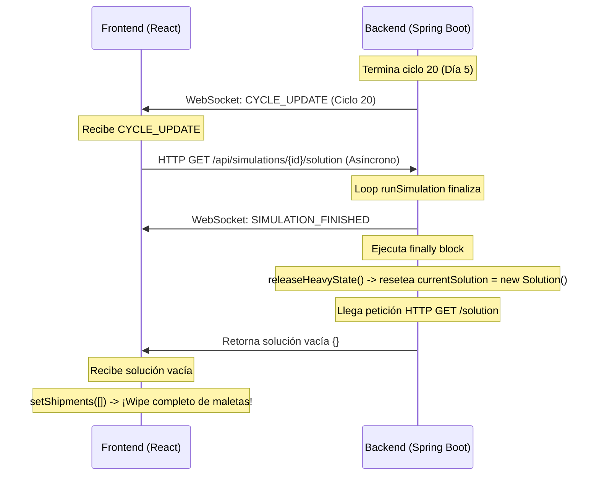

# Análisis Detallado: Congelamiento del Mapa y Reporte Final en Cero

Tras analizar los últimos cambios en la sincronización del reloj y la actualización de datos entre el backend (`scheduling-core`) y el frontend (`Skytrack-Frontend`), se han identificado las causas exactas de los problemas reportados. A continuación se detallan las razones y cómo solucionarlos paso a paso.

---

## 1. Congelamiento del Mapa (1-2s) y Retraso en el Mouse Over

### 🔍 Causas Raíz
Cada vez que el backend emite un evento `CYCLE_UPDATE` (que ocurre al finalizar una planificación), el frontend realiza una petición HTTP asíncrona para obtener la solución completa con `getSimulationSolution(id)` y la procesa en el hilo principal de JavaScript.

1. **Procesamiento Ineficiente de Fechas ($O(N \log N)$):** 
   En `mapper.ts` ([mapper.ts:L188](file:///C:/Users/Irico/Documents/DP1/Skytrack-Frontend/src/app/services/mapper.ts#L188)), la función `mapSolutionToShipments` realiza un ordenamiento de los vuelos para cada una de las rutas:
   ```typescript
   const orderedFlights = [...route.flights].sort((a, b) =>
     new Date(a.departureTime).getTime() - new Date(b.departureTime).getTime()
   );
   ```
   Para el ciclo 15, con **7,702 rutas** y múltiples vuelos por ruta, instanciar `new Date()` repetidamente dentro de la función de comparación de `sort` realiza decenas de miles de alocaciones y conversiones de texto a fecha en milisegundos. Esto bloquea el hilo principal (Single-Thread) del navegador durante 1 o 2 segundos.
   
2. **Cálculos Innecesarios en `WorldMap.tsx`:**
   En `WorldMap.tsx` ([WorldMap.tsx:L708-729](file:///C:/Users/Irico/Documents/DP1/Skytrack-Frontend/src/app/components/WorldMap.tsx#L708-L729)), la variable `shipmentData` ejecuta un bucle `map` sobre las 7,700 maletas y realiza una búsqueda lineal en los aeropuertos (`airports.find`) por cada una.
   Sin embargo, en modo real/5day, `shouldShowStaticFallback` es `false`, por lo que **ninguno de estos elementos de maleta se dibuja en el SVG del mapa**. El cálculo de `shipmentData` se ejecuta por completo y se descarta, consumiendo CPU en vano.

3. **Cálculos en cada tick de reloj (100ms) en paneles laterales:**
   El reloj de simulación actualiza el estado `simClock` cada 100ms. Esto provoca re-renders del componente `RightPanel.tsx` cada 100ms. Dentro de este, operaciones como `shipments.filter(s => s.isReplanned)` se ejecutan incondicionalmente sin memoización en cada tick, sumando sobrecarga constante.

> [!IMPORTANT]
> **Efecto en el Mouse Over:** 
> Al estar bloqueado el hilo principal de JavaScript por el procesamiento masivo de datos del ciclo, los eventos del mouse (`onMouseEnter`, `onMouseLeave`) de los círculos de los aeropuertos quedan en la cola de eventos y no se ejecutan hasta que el navegador se libera, lo que da la sensación de que el mapa se "traba" o no responde en tiempo real.

---

## 2. Reporte Final con 0 Envíos y 0 Rutas Planificadas

### 🔍 Causa Raíz: Condición de Carrera al Finalizar (Desenmascarada por el Fix de Fin de Simulación)
Al completarse los 5 días de simulación, el backend y el frontend entran en un conflicto de tiempos (Race Condition) debido a la liberación prematura de memoria en el backend:



### ¿Por qué funcionaba antes?
* **Antes (Condición de parada bugueada):** En el compilado anterior, la condición de parada dependía del tiempo real transcurrido (`daysElapsed >= 5.0`). Dado que la simulación corre acelerada ($K=120$), el algoritmo completaba los 20 ciclos planificados mucho antes de que pasara 1 hora de tiempo real. Por ello, la simulación **nunca terminaba de forma natural** en el backend y seguía ejecutando ciclos infinitamente en segundo plano. Al no terminar, **el bloque `finally` nunca se ejecutaba y la solución `currentSolution` nunca se limpiaba de memoria**. El frontend podía descargar `/solution` sin problemas.
* **Ahora (Condición de parada corregida):** El último cambio corrigió la parada para que termine exactamente cuando el cursor de planificación llega a 5 días:
  ```java
  if (simulationEndTime != null && !planningCursor.isBefore(simulationEndTime))
  ```
  Esto hace que la simulación **sí termine de forma natural**, ejecutando de inmediato el bloque `finally` que llama a `releaseHeavyState()` para vaciar la memoria. Al vaciarla, la petición `/solution` del último ciclo del frontend (que se ejecuta asíncronamente milisegundos después) recibe una solución vacía y limpia todo el historial de maletas.

1. **Liberación Instantánea de Memoria:** En `SimulationController.java` ([SimulationController.java:550](file:///c:/Users/Irico/Documents/DP1/scheduling-core/src/main/java/com/equipo2b/scheduler/execution/SimulationController.java#L550)), el método `releaseHeavyState` se ejecuta inmediatamente en el bloque `finally` al terminar el hilo de simulación. Esto limpia `currentSolution` (asignándole un `new Solution()`) para liberar RAM.
2. **Petición HTTP Destructiva:** Mientras tanto, el frontend está llamando asíncronamente a `/api/simulations/{id}/solution` como respuesta al último ciclo. Al procesarse en el controlador REST, el backend ya limpió la solución de memoria y devuelve un objeto vacío. El frontend mapea esto y limpia su estado local `shipments` dejándolo con longitud `0`.
3. **Mapeo de Snapshots sin Datos de Carga:** El frontend intenta reconstruir los totales usando los snapshots diarios devueltos por el archivo JSON (`getSimulationResults`). Sin embargo, en `mapper.ts` ([mapper.ts:85](file:///C:/Users/Irico/Documents/DP1/Skytrack-Frontend/src/app/services/mapper.ts#L85)), el campo `totalBags` está harcodeado a `0`:
   ```typescript
   totalBags: 0,  // no tenemos este dato por día en el resumen
   ```
   Al estar vacío `shipments` y tener `totalBags` en 0, el reporte final muestra un resumen completamente vacío (`0` envíos y `0` rutas).

---

## 🛠️ Plan de Solución Detallado

Para resolver estos problemas sin alterar la lógica de negocio ni degradar el rendimiento, se deben aplicar las siguientes correcciones:

### Paso 1: Optimización del Rendimiento en el Frontend

1. **Optimizar `mapSolutionToShipments` en [mapper.ts](file:///C:/Users/Irico/Documents/DP1/Skytrack-Frontend/src/app/services/mapper.ts):**
   Pre-parsear las fechas de los vuelos una sola vez antes de realizar el ordenamiento y búsquedas, reduciendo las llamadas a `new Date()` de $O(N \log N)$ a $O(N)$:
   ```typescript
   export function mapSolutionToShipments(solution: BackendSolution, simulatedTime: Date): Shipment[] {
     const now = simulatedTime.getTime();
     return solution.routes.map(route => {
       // Pre-parsear fechas una única vez por vuelo
       const orderedFlights = route.flights.map(f => ({
         ...f,
         depMs: new Date(f.departureTime).getTime(),
         arrMs: new Date(f.arrivalTime).getTime()
       }));
       orderedFlights.sort((a, b) => a.depMs - b.depMs);

       const firstDeparture = orderedFlights[0];
       const finalArrival = route.finalArrivalTime;
       const startMs = firstDeparture ? firstDeparture.depMs : now;
       const endMs = new Date(finalArrival).getTime();
       
       const progress = Number.isFinite(startMs) && Number.isFinite(endMs) && endMs > startMs
         ? clamp((now - startMs) / (endMs - startMs))
         : 0;

       const activeFlight = orderedFlights.find(f => now >= f.depMs && now <= f.arrMs)
         ?? orderedFlights.find(f => f.arrMs >= now)
         ?? orderedFlights[orderedFlights.length - 1];

       return {
         id: route.batchId,
         airlineId: route.clientId || 'UI',
         airline: route.clientId || 'Cliente',
         origin: route.originId,
         destination: route.destinationId,
         currentFlightId: activeFlight?.flightId ?? 'PENDING',
         luggageCount: route.quantity,
         status: route.meetsSLA ? 'on-time' : 'delayed',
         progress,
         estimatedDelivery: formatDelivery(finalArrival),
         isReplanned: orderedFlights.length > 1,
       };
     });
   }
   ```

2. **Evitar cálculos innecesarios en [WorldMap.tsx](file:///C:/Users/Irico/Documents/DP1/Skytrack-Frontend/src/app/components/WorldMap.tsx):**
   Retornar inmediatamente un array vacío para `shipmentData` y `flightPaths` si no estamos en modo offline/fallback, ya que estas geometrías no se pintan en simulación real:
   ```typescript
   const shipmentData = useMemo(() => {
     if (!shouldShowStaticFallback) return [];
     return shipments.map(s => { ... });
   }, [shipments, airports, shouldShowStaticFallback]);

   const flightPaths = useMemo(() => {
     if (!shouldShowStaticFallback) return [];
     return flights.map(f => { ... });
   }, [flights, airports, shouldShowStaticFallback]);
   ```

3. **Memoizar filtros en [RightPanel.tsx](file:///C:/Users/Irico/Documents/DP1/Skytrack-Frontend/src/app/components/RightPanel.tsx):**
   Evitar el filtrado incondicional en cada tick de 100ms usando `useMemo`:
   ```typescript
   const recentReplanned = useMemo(() => 
     shipments.filter(s => s.isReplanned),
     [shipments]
   );
   ```

---

### Paso 2: Solución de la Condición de Carrera en el Backend

1. **Evitar la limpieza inmediata de la solución en [SimulationController.java](file:///c:/Users/Irico/Documents/DP1/scheduling-core/src/main/java/com/equipo2b/scheduler/execution/SimulationController.java):**
   No se debe resetear `currentSolution = new Solution()` en `releaseHeavyState()` al terminar `runSimulation`. La simulación ya se considera inactiva, y el recolector de basura o el método manual `reset()` (al llamar a `/stop` o `/start` de nuevo) se encargarán de liberar esta memoria cuando la visualización haya terminado y el usuario decida salir.
   
   Modificar `releaseHeavyState` para mantener la última solución:
   ```java
   private void releaseHeavyState(ScenarioType scenario) {
       if (scenario == ScenarioType.PERIOD_SIMULATION || scenario == ScenarioType.DAY_TO_DAY) {
           currentBatches = Collections.emptyList();
           // CORTAR O REMOVER ESTA LÍNEA para evitar borrar los resultados de la API REST
           // currentSolution = new Solution(); 
           scheduler = null;
           tabuSearch = null;
           validator = null;
           System.out.println("✓ Referencias pesadas liberadas tras finalizar " + scenario.name());
       }
   }
   ```

---

### Paso 3: Corrección de Datos de Reporte en el Frontend

1. **Mapear correctamente los snapshots en [mapper.ts](file:///C:/Users/Irico/Documents/DP1/Skytrack-Frontend/src/app/services/mapper.ts):**
   En lugar de harcodear `totalBags: 0`, podemos asignar el valor acumulado si está disponible en la respuesta JSON o en su defecto estimarlo a partir de las rutas completadas multiplicadas por un factor promedio o guardándolo en el DTO de resultados en el backend si se desea mayor precisión.
   
2. **Robustecer fallbacks en [FiveDayResults.tsx](file:///C:/Users/Irico/Documents/DP1/Skytrack-Frontend/src/app/components/FiveDayResults.tsx):**
   En el componente de resultados, si `shipments` tiene longitud 0 (por ejemplo, si el usuario refrescó la página justo al terminar), usar los datos consolidados que provee `lastCycleUpdate` u `operationalMetrics` en lugar de fallar a cero:
   ```typescript
   const totalShipments = shipments.length > 0 
     ? shipments.length 
     : (lastCycleUpdate?.totalRoutes ?? results?.totalBatches ?? 0);
   ```
